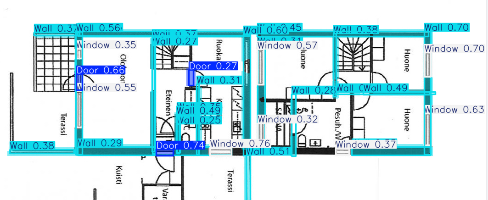

# TTCN_NGUYENTHANHHOAI_DH52200700
Đây là nơi báo cáo thực tập chuyên ngành

# Thông Tin Sinh Viên
<b>SV</b>: Nguyễn Thanh Hoài. 
<b>Gmail</b>: disbray100@gmail.com. 
<b>MSSV</b>: DH52200700 
<b>Giáo Viên Hướng dẫn</b>: Trần Quốc Trường.

Link đến github chính: [Revit Viet Kit](https://github.com/thanhhoai2k4/RevitVietKit)

# Bao Cáo

<table>
  <tr>
    <td>
      
    </td>
    <td>
      
    </td>
  </tr>
</table>

Chuẩn bị dữ liệu:
- Tải dữ liệu từ [Cubicassa5k](https://zenodo.org/records/2613548): 5k hình ảnh với nhãn là các file svg. Đọc các file SVG. trích xuất các labels ra. Và lưu vào thư mục riêng. Chuẩn đầu vào của YOLO SEG. Với định dạng(polygon):
> label x1,y1 x2,y2 x3,y3 x4,y4.

- Đăng data lên drive: sau đó sử dụng colab. để huấn luyện. Tuy nhiên với lượng dữ liệu lớn và tần suất của các label xuất hiện dày đặc vì thế cần huấn luyện với thời gian dài. Thực tế khi em huấn luyện model trên colab dù em đả chọn model với tham số ít nhất (nano). thì nó vẫn bị chậm.=>Em nghỉ đến 1 lựa chọn là Thue 1 GPU. Trước đây em đả từng thuê GPU để huấn luyện [PHÁT HIỆN ĐỐI TƯỢNG YOLO V3](https://github.com/thanhhoai2k4/yolo-v3-by-tensorflow) và keras CV cho phát hiện đèn giao thông.

Danh sách việc cần làm tuần sau:
- Viết 1 dự án nhỏ để có thể tự động huấn luyện model từ máy tính khác.
- Thuê  [GPU](https://thuegpu.vn/) để huấn luyện.</td>
- Đánh giá.
- Cân nhắc làm việc tiếp theo nếu hoàng thành sớm.

# báo cáo

## 1. Phân tích vấn đề.

- Dựa vào ảnh mà ultralytics cung cấp về các dự đoán của 3 đối tượng: Wall, Door, Window.

- False Negatives (Bỏ sót): Mô hình đang bỏ sót rất nhiều đối tượng và nhầm chúng là "background".

> 30% số "Door" thật bị dự đoán là "background".

>34% số "Wall" thật bị dự đoán là "background".

>18% số "Window" thật bị dự đoán là "background".

- False Positives (Dự đoán nhầm): Khi mô hình nhìn vào một vùng "background" thật, nó lại dự đoán nhầm đó là một đối tượng, đặc biệt là "Wall".

- Em nhận ra rằng mô hình của em đang bối rối trong việc phân biệc đâu là Wall và đâu là các background.

Hướng đi: 
+ Em tạo thêm 100 tấm ảnh trắng bằng Python Code và nhãn trắng (Rỗng).
+ Thêm vào tập dữ liệu.
+ Đi huấn luyện

=> giải quyết được vấn đề: Trừng phạt nằng nề vào các đối không có gì mà dự đoán có gì. Lúc này. Cần mô hình cần biết được im lặng đối với các ảnh trắng.

Các đặt trưng bị mất đi khi scale lại từ ảnh gốc:
- Dữ liệu của em lấy từ cubicassa5k ở folder: high_quality_architectural. Với các ảnh gốc có độ phân giải cao: 2000x2000 pixel.  Và em sử dụng model của Ultralytics để huấn luyện vì thế đầu vào của ảnh sẻ được scale lại 640x640 để đưa vào trong model. Và vấn đề là các đối tượng bình thường có kích thước chiều rộng là khoang 50px đến 100px sau khi scale lại thì nó chỉ còn được vài chục pixel. Và sau đó đi qua các lớp tích chập cực sâu. Các đặt trưng(fueture) bị mờ nhạc ở đầu ra dự đoán.

Sau khi em tham khảo: 1 kỹ thuật dự đoán ảnh là [tiled](https://docs.ultralytics.com/vi/guides/sahi-tiled-inference/#import-modules-and-download-resources) cuả ultralytic thì em có nghĩ ra 1 cách giải quyết là. Thay vì chúng ta tăng kích thước của input model. Thì sao chúng ta không THực hiện cắt ảnh ra theo từng vùng để có thể tăng kích thước của các đối tượng. Sau đó em viết 1 đoạn mã để tạo ra được dữ liệu cắt theo 1 cửa sổ trược trên ảnh. Dataset em lưu ở [kaggle](https://www.kaggle.com/datasets/mthcknng/floor-plan-dataset).

Kết quả:

<table>
  <tr>
    <td>
      
    </td>
    <td>
      
    </td>
  </tr>
</table>

Nhìn vào kết quả trên. hầu hết các đối tượng được nhận diện đúng và chính xác. Chỉ có 1 số các đối tượng rìa tường ở bên ngoài đả sai. Em sẽ có chính sách cải cách độ chích sát của các model ở tương lai.

+ Quan sát và đem những ảnh dự đoán hỏng nhiều. Vào huấn luyệ lại 1 lần nữa.

Note: Dữ liệu là quan trọng nhất. Cho dù model tốt đến đâu.

## CV Tuần sau

- Thực hiện chuyển đổi các đối tượng vào trong revit.
- Xây dựng 1 package cho nhiệm vụ này.

## Hoc Django.
Những thứ đả học:
- Cài đặt, Cấu hình dự án cho việc gỡ lổi,
- Tạo file cài đặt chung cho việc sử dụng ở những thiết bị khác
- Hiểu được luồn flow của dữ liệu đi
  !(anh mau)[images/django-backbone (1).png]
- kết nối được cơ sở dữ liêu: ở đây em sử dụng postgresql. Vì nó hổ trợ nhiều thứ hơn là các hệ quản trị cơ sở dữ liệu khác.
- Em có viết 1 đoạn mã để khi người dùng gửi file ảnh và thực hiện detecntion:
  !(anh mau)[images/django-backbone (1).png]
- Sử dụng kế thừa giao diện.
